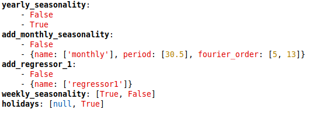

# Prophet Grid Search Cross Validation #

This package allows to perform a hyper parameters multiprocessing grid search on top of the Facebook's prophet package.

### Installation ###
#### Pip + Repository

You may install the package using pip. In order to do that, copy the url provided in the clone button available in bitbucket (top right of the main page of the repository), which will have a similar format to:

`https://<account_name>@bitbucket.org/sdggroup/prophet_gridsearch.git`

where `<account_name>` has to be substituted with your bitbucket account name. Then open a command prompt and use that url to install the package with pip:

`pip install git+https://<account_name>@bitbucket.org/sdggroup/prophet_gridsearch.git`

In order to install from a specific git branch execute the following:

`pip install git+https://<account_name>@bitbucket.org/sdggroup/prophet_gridsearch.git@<branch>`

#### Anaconda
It is highly recommendable to create a new virtual environment to avoid damaging the base environment. Further steps are given below. Along the process, it will be assumed that Anaconda is installed. It will also be assumed that the current directory is the git repository.

First, go to the package folder. Next, we'll create the environment:

`conda env create -f prophet_gridsearch.yaml`

Activate the environment:

`conda activate prophet_gridsearch`

Install prophet_gridsearch:

`pip install .`

## Configuration
The Grid search combination is passed through a dictionary of lists with all the given Hyper Parameters. In the image above it is configured a 48 combinations grid search. For example:

### General Hyperparameters
All Prophet Class Parameters are tunable, however some are more likely to work successfuly than others. In Prophet's API you can find a [list of such parameters](https://facebook.github.io/prophet/docs/diagnostics.html#hyperparameter-tuning).

### Holidays
Holidays Parameter is a little diferent, because it can either be nothing or a pandas DataFrame. Go to the Prophet [Holidays](https://facebook.github.io/prophet/docs/seasonality,_holiday_effects,_and_regressors.html#modeling-holidays-and-special-events) documentation for further information.

### Aditional Seasonalities and Regressors
In orther to add aditional regressors or seasonalities, just add parameters starting with "add_" and ending with either "regressor" or "seasonality" respectibly. Then add the current [regressor](https://facebook.github.io/prophet/docs/seasonality,_holiday_effects,_and_regressors.html#additional-regressors) or [seasonality](https://facebook.github.io/prophet/docs/seasonality,_holiday_effects,_and_regressors.html#specifying-custom-seasonalities) configuration as a list.

You can try different combinations of seasonalities and regressor exacly the same as the general Hyperparameters.

In order to know more about the possible Prophet Hyper parameters and additional regressors and seasonalities values, look in the [Prophet documentation](https://facebook.github.io/prophet/docs/quick_start.html#python-api):
